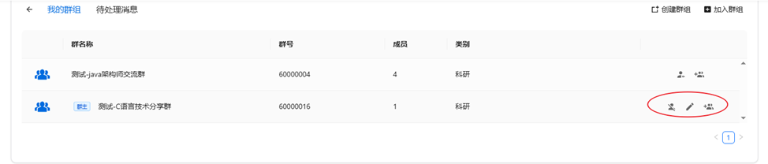

# 群组云盘

群组功能是团队协作的核心工具，允许成员共享文件、协同编辑并管理权限。点击个人中心群组应用图标或底部导航栏中群组链接可以进入到群组模块。

- 群组空间计入创建者的使用空间总容量。

## 创建群组

点击页面中的创建群组按钮，可以创建群组。本系统中群组名称不能同名。

## 群组管理

点击群组列表中右侧操作栏，群主可以进行对群组进行 编辑、解散、邀请入群操作。用户群组的身份不同，操作权限不同。

## 加入群组

用户可以通过以下方式加入群组：

- 点击加入群组按钮，搜索指定群组加入；
- 或者通过邀请链接，申请加入。

## 群组成员

进入群组主页，群主或群管理员可以对成员进行管理操作，同时支持：

- 移除成员：成员列表 → 点击用户右侧 移除成员 图标进行 「移除」
- 转让群主：成员列表 → 点击用户右侧  转让群主 图标进行 「转让」

## 群组权限管理

群组云盘面向成员员共有三种权限可以配置，**管理**权限、**编辑**权限和**只读**权限，可以点击权限设置按照人员选择配置即可，三类权限区别见下表。

- 所有加入群组的成员默认具有**只读**权限；
- 管理员可以配置编辑权限和管理权限；

| 操作       | **只读**（默认） | **编辑** | **管理** |
|------------|---------------|------|------|
| 预览       | √             | √    | √    |
| 创建/上传  |               | √    | √    |
| 下载       | √             | √    | √    |
| 编辑       |               | √    | √    |
| 删除       |               | √    | √    |
| 重命名     |               | √    | √    |
| 保存到个人云盘 |               | √    | √    |
| 设置标签   |               | √    | √    |
| 历史版本   |               | √    | √    |

## 群组资料库

每个群组默认创建一个共享资料库，所有群组成员根据权限可以访问群组资料库内的文件。

- 共享所有权：群组内所有成员均可访问（权限由管理员控制）。
- 自动同步：成员通过客户端同步后，文件实时更新。
- 独立存储：与个人资料库分离，专用于团队项目。
