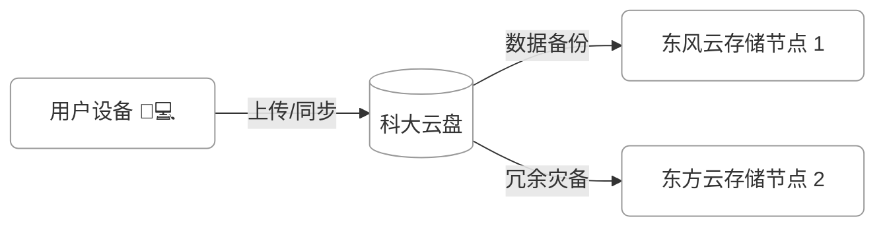
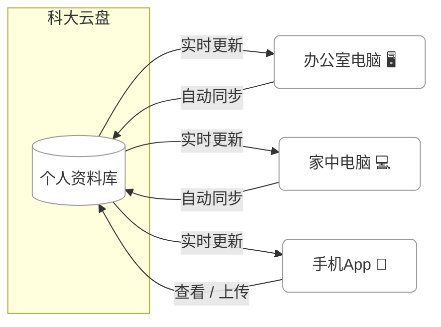
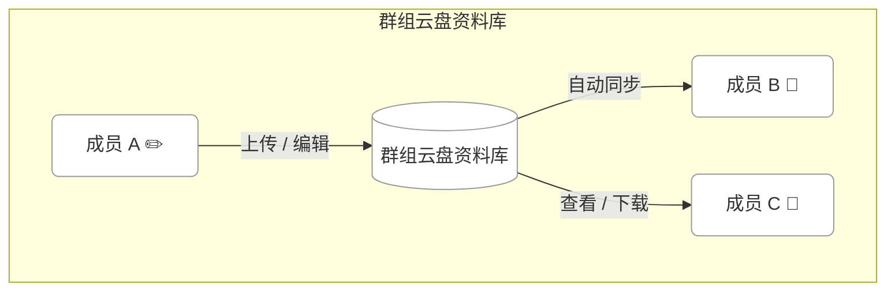
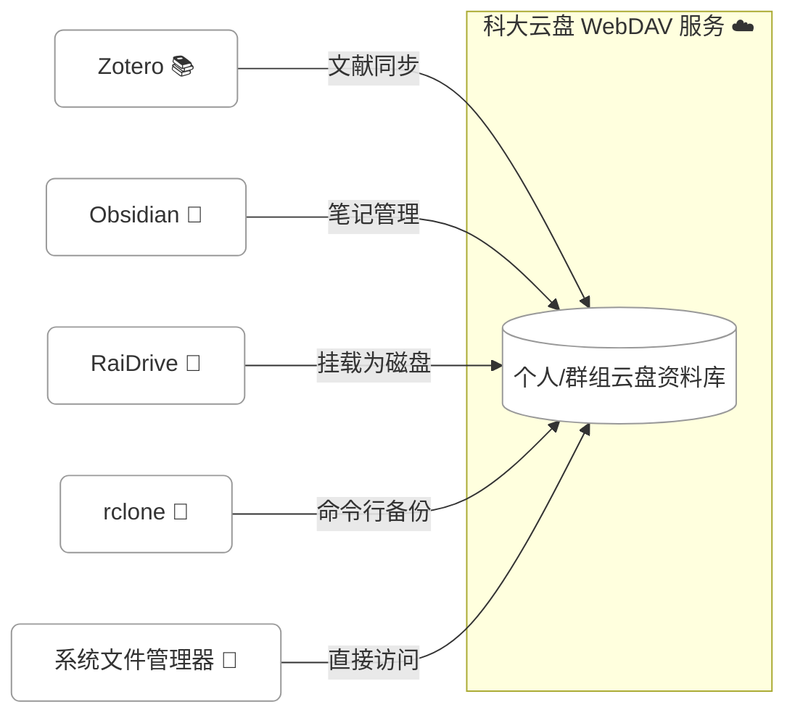

# 科大云盘使用手册
!!! warning "注意"
    
    睿客网将于2025年12月下线，数据迁移工具已经发布，详见[链接](https://pan.ustc.edu.cn/doc/transfer/)，数据迁移工具也支持校友将数据下载至本地。
---
科大云盘基于 [Seafile 企业版](https://www.seafile.com/features/) 定制开发，支持文件的安全存储、自动备份、多终端同步与团队协作，支持全平台客户端访问，为教学、科研与办公场景提供高效的数据管理能力。系统同时系统集成 [OnlyOffice](https://www.onlyoffice.com/zh/)，可在线协作编辑 Word、Excel、PPT 等常用文档格式。

### 🗂️ 1. 文件存储与备份 — 安全可靠的“数字保险箱”

科大云盘提供 **校园级云端存储空间**，支持任意格式文件上传与分类管理。  
- 文件保存在校内服务器，数据传输全程加密  
- 可通过网页端、桌面端、移动端随时访问  
- 个人网盘支持版本管理与历史文件恢复，防止误删  

### 🔄 2. 多设备同步 — 无论在哪台设备上都能接着工作

科大云盘支持 **多设备实时同步**，让你的文件在不同终端间无缝衔接：  
- 在办公室电脑编辑的文件，家中电脑、笔记本自动同步更新  
- 支持网页、Windows、macOS、Linux 、移动APP和WebDAV  
- 可按需选择同步文件夹，节省本地空间  
- 修改或删除自动同步，无需人工干预  

### 👥 3. 团队协作共享 — A 修改，B 同步，C 随时查看

科大云盘为 **课题组、办公室、社团团队** 提供便捷的多人协作功能：  
- 创建共享群组空间，支持多成员共同访问  
- 成员 A 修改文档后，成员 B 自动同步到最新版本  
- 支持权限控制（只读、可编辑、可上传）  

### 🌐 4. WebDAV 集成 — 在第三方工具中无缝访问科大云盘

科大云盘支持 **WebDAV 协议**，可作为标准网络磁盘挂载使用，  
让你在各种第三方应用中直接访问、编辑、同步云盘文件。

#### 🚀 可用场景
- 在 **Windows / macOS / Linux** 上挂载为本地磁盘，实现文件拖拽与本地编辑  
- 与 **Zotero、GoodNotes、Obsidian、RaiDrive、rclone** 等常用工具集成  
- 支持自动同步、文件索引与全文检索  
- 无需额外客户端，即可通过系统或第三方软件直接连接  

👉 云盘地址：[https://pan.ustc.edu.cn](https://pan.ustc.edu.cn)

## 📢 用前必读

**科大云盘提供在校师生、准研究生和校外合作三种账号类型，权限略有区别**：

| 用户类型   | 存储空间 | 🧾 账号说明                 | 注册方式         | 登录方式               |
|------------|-----------|-----------------------------|------------------|------------------------|
| 在校师生   | 1TB       | 长期账号，离校后将回收     | 自动开通         | 统一身份认证           |
| 准研究生   | 100GB     | 短期账号，报到后可转在校师生 | 个人申请 + 导师审批 | 账号密码 + 2FA   |
| 校外合作   | 100GB     | 短期账号，定期回收         | 个人申请 + 合作教师审批 | 账号密码 + 2FA |

## 账号回收

已离校、已毕业的师生以及到期的短期账户会自动回收，被回收的账号按照以下流程注销：

- 180 天内：可登录并访问文件，但仅限预览与下载；
- 180~365 天内：无法登录系统；
- 365 天以后：系统将注销账号并释放全部资源。
---

## ✨ 平台特色

- 🗄️ **超大空间**：在校师生默认配置 1TB 云盘空间，课题组、实验室、社团可按需申请扩容
- 🖥️ **全平台支持**：兼容桌面（Windows、macOS、Linux）、移动（iOS、Android）及网页
- 🔗 **WebDAV 挂载**：可作为本地磁盘进行访问（支持主流客户端）
- 👥 **协作功能丰富**：群组云盘支持多用户权限设置、在线协同编辑 Office 文档

!!! note "提示"

    科大云盘在持续优化中，如果您有好的建议意见，欢迎发送电子邮件至[wf0229@ustc.edu.cn](mailto:wf0229@ustc.edu.cn)。
---
