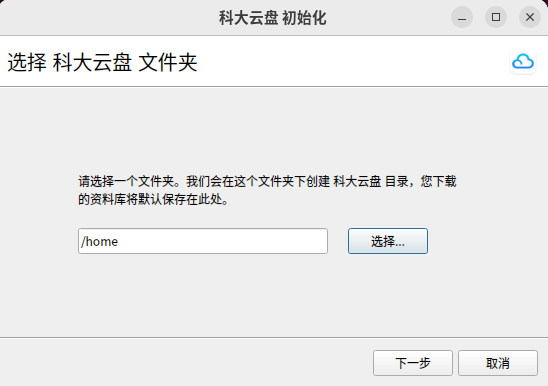
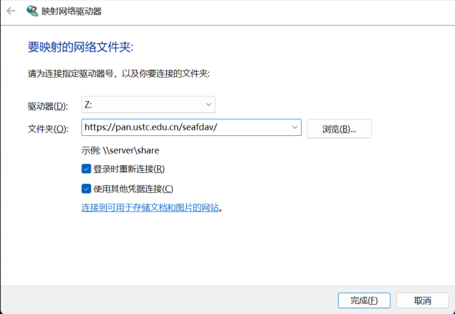
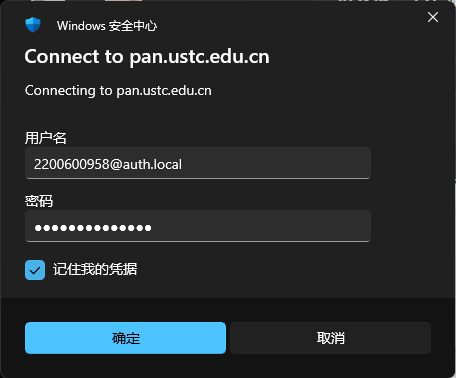

# 安装指南

## 支持系统

| 平台 | 访问方式 / 支持情况 | 说明 |
| :-- | :-- | :-- |
| 🌐 **网页版** | ✅[https://pan.ustc.edu.cn](https://pan.ustc.edu.cn) | 直接访问即可使用 |
| 📱 **iOS / Android 客户端** | 应用商店下载 | 正在进行备案，尚未发布 |
| 💻 **Windows 桌面客户端** | ✅ Windows 10 及以上版本<br>❌ 不支持 Windows 8.1 及更早版本 | [微软官方已停止支持Win8](https://www.microsoft.com/zh-cn/windows/end-of-support) |
| 🍎 **macOS 桌面客户端** | ✅ macOS 11 及以上版本 |  |
| 🐧 **Linux 桌面客户端** | ✅ 支持主流发行版 | 包括Ubuntu、Debian、Fedora等|
| 🐧 **WevDAV** | ✅ 支持 | 支持 Cyberduck、rclone、zetero 等|

---

### Windows 客户端安装

1. 访问 [科大云盘首页](https://pan.ustc.edu.cn/home/index)，下载最新 Windows 客户端安装包；
2. 双击运行安装程序，按提示完成安装；
3. 启动客户端，使用统一身份认证即可登录使用。


---

### macOS 客户端安装

1. 访问 [科大云盘首页](https://pan.ustc.edu.cn/home/index)，下载 macOS 安装文件；
2. 将“科大云盘”图标拖入“应用程序”文件夹；
3. 启动客户端，使用统一身份认证即可登录使用。


---

### Linux 客户端安装

1. 访问 [科大云盘首页](https://pan.ustc.edu.cn/home/index)，下载 Linux 安装文件；
2. 打开命令行工具Terminal,执行以下命令并按照提示操作即可
```bash
# 为安装文件增加可执行权限
sudo chmod +x ./USTC_Drive_1.1.9.AppImage

# 科大云盘依赖FUSE，请根据Linux发行版选择对应指令
Ubuntu / Debian:    sudo apt install fuse
Fedora / RHEL:      sudo dnf install fuse
openSUSE:           sudo zypper install fuse
Arch Linux:         sudo pacman -S fuse
Alpine:             sudo apk add fuse

# 安装
./USTC_Drive_1.1.9.AppImage
```
3. 安装完成后，启动客户端，使用统一身份认证即可登录使用。



---

### WebDAV 连接

1. 访问 [科大云盘WevDAV配置页面](https://pan.ustc.edu.cn/my/webDav)，配置WebDAV访问密码；

!!! warning "WebDAV方式的一次性密码"
    WebDAV依赖于第三方软件客户端，科大云盘通过一次性密码控制密码泄露风险，请在启用WebDAV方式后妥善保管密码，以免造成云盘文件和数据泄露。

2. 在支持的第三方客户端中配置WevDAV，以Window 11 映射网络驱动器为例：





3. 确认后即可完成WebDAV连接，其他第三方软件客户端参考配置即可。

---
