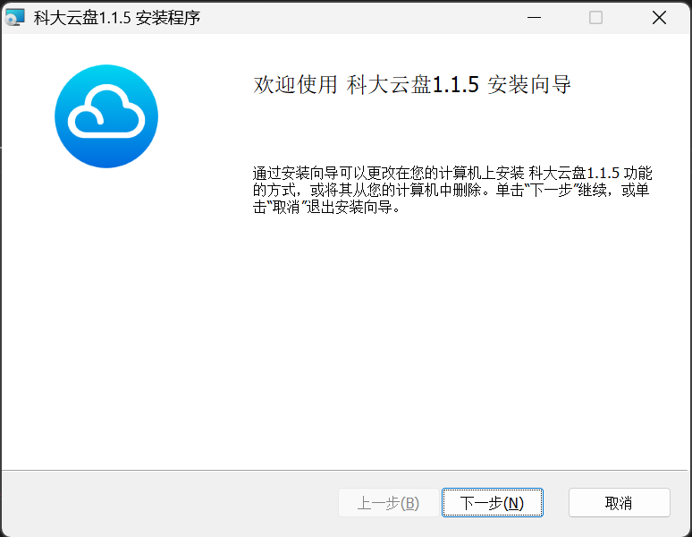

# 安装指南

科大云盘支持多种访问方式，适配不同使用场景，您可以根据自己的设备选择合适的客户端或访问方式进行配置。

---
## 🌍 网页版本

- 在浏览器中输入 https://pan.ustc.edu.cn ，点击右上角登录即可使用。
- 网页版无需安装，也无需安装浏览器插件。

{ width="200" }

## 🖥️ 桌面客户端

科大云盘客户端支持：

- Windows 10 及以上；
- macOS 11 及以上；
- Linux发行版包括Ubuntu、Debian、Fedora；

- 不支持 Windows 8.1 和 Windows 7 的计划，因为[微软已经终止对这两个版本操作系统的支持](https://www.microsoft.com/zh-cn/windows/end-of-support)。

### 🪟 __Windows__

- 在 [科大云盘首页](https://pan.ustc.edu.cn/home/index) 下载最新版本的安装文件
- 点击根据提示安装：

{ width="200" }

- 

### __Mac__

- 在 [科大云盘首页](https://pan.ustc.edu.cn/home/index) 下载最新版本的安装文件
- 点击根据提示安装：

{ width="200" }

### __Linux__

- Linux版本尚未发布。

---

## 📱 移动端

iOS和Android客户端预计在6月完成开发测试，待完成备案审批后正式发布，计划支持：

- iOS/iPadOS 11.0 及以上；
- Android 8.0 及以上。

---

## 🔗 WebDAV 挂载

WebDAV 尚未发布。

---

## ⚠️ 注意事项

!!! note "使用建议"

    - 推荐优先使用桌面端，可获得更好的同步体验。
---

如遇安装问题，请先查看 [常见问题](../faq/index.md)，或联系技术支持获取帮助。
