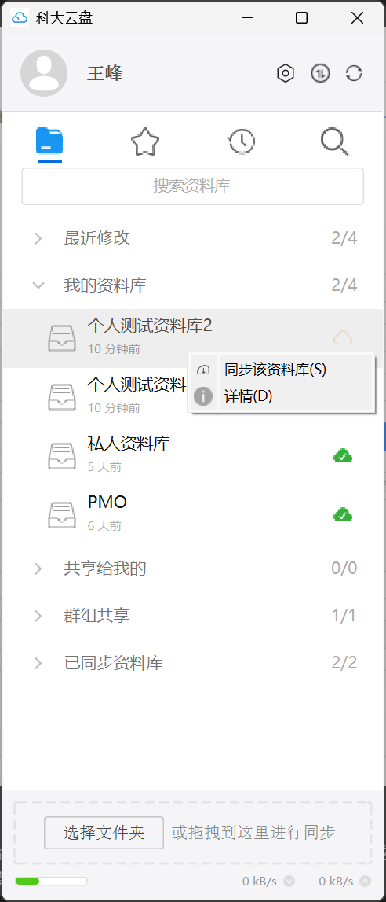

# 关于资料库

科大云盘继承Seafile的功能，采用 **资料库（Library）** 管理用户的文件（夹），资料库可以看成是顶级文件夹（Folder）但略有不同。

- 个人云盘可以创建多个 资料库，资料库可以类比为Windows操作系统的C盘、D盘、E盘，建议通过资料库来隔离业务；
- 每个群组云盘只对应一个资料库，群组本身就是根目录/顶级文件夹。

| 项目             | 资料库（Library）                         | 文件夹（Folder）                           |
|------------------|--------------------------------------------|--------------------------------------------|
| 层级             | 顶层单位，相当于一个独立的网盘| 资料库内部的层级结构，用于组织和管理文件         |
| 客户端呈现       | 客户端显示所有资料库，不论是否自动同步| 客户端支持同步指定文件夹，但仍显示资料库 |
| 权限控制         | 支持重命名、删除             | 支持收藏、分享、重命名、移动、复制、删除                    |
| 移动范围         | 不能直接将资料库移动至其他资料库       | 可以将文件（夹）移动、复制至其他资料库         |
| 使用场景推荐 | 建议业务隔离，例如科研、教学、管理资料库     | 按需组织即可|

如图所示，客户端软件会显示所有 资料库 。

