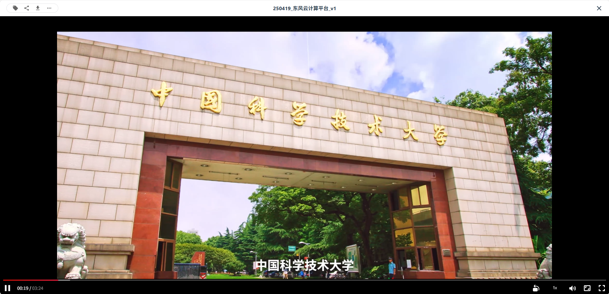
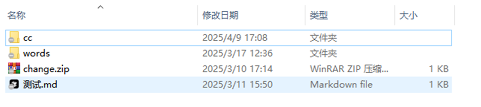
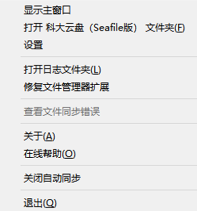

# 个人云盘使用

本手册将详细介绍了科大云盘（下文简称“系统”）账号管理、网页版和客户端的使用。

## 页面目录

- [登录与注册](#登录与之策)
- [关于资料库](#关于资料库)
- [网页版使用](#网页版使用)
- [桌面客户端使用](#桌面客户端使用)

## 登录与注册

对于在校师生，直接使用统一身份认证即可访问系统。
- 网页版，点击右上角登录，在跳转页面点击统一身份认证；
- 桌面客户端登录，会调用系统默认浏览器，跳转统一身份认证，认证通过后自动同步登录状态。

对于准研究生和校外合作用户，系统支持注册临时账号：
- 在登录页面点击 [临时账号申请](https://pan.ustc.edu.cn/apply_temp_account/index)，按照提示填写提交：

{ width="200" }

- 校内导师/合作教师会收到校外合作账号创建申请，同意后会转给科大云盘系统管理员处置，办理完成后账号和密码会发送到注册邮箱中。
- 临时账号在登陆页面“临时账号”方式，每次需要提供账号邮箱、密码并完成短信校验，以确保本人使用。

## 关于资料库

- 本系统采用 **资料库（Library）** 管理用户的文件和文件夹，资料库可以看成是顶级文件夹（Folder）但与文件夹略有不同；
- 个人云盘可以创建多个 资料库，资料库可以类比为Windows操作系统的C盘、D盘、E盘，建议用来作业务的隔离；
- 每个群组云盘对应一个资料库，群组本身就是根目录/顶级文件夹。

| 项目             | 资料库（Library）                         | 文件夹（Folder）                           |
|------------------|--------------------------------------------|--------------------------------------------|
| 层级             | 顶层单位，相当于一个独立的网盘| 资料库内部的层级结构，用于组织和管理文件         |
| 客户端呈现         | 客户端软件会显示所有资料库，不论是否自动同步| 客户端支持同步指定文件夹，但仍显示资料库 |
| 权限控制         | 支持重命名、删除             | 支持收藏、分享、重命名、移动、复制、删除                    |
| 移动范围         | 不能直接将资料库移动至其他资料库       | 可以将文件（夹）移动、复制至其他资料库         |
| 使用场景推荐 | 建议业务隔离，例如科研资料库、管理资料库、教学资料库     | 按需组织即可|

如图所示，客户端可以按照以 资料库 为单位选择自动同步至本地。

## 网页版使用

### 新建资料库

点击新建资料库按钮，可以新建并命名资料库，资料库支持 重命名 和 删除 操作，如下图所示:

{ width="200" }

### 新建文件/文件夹

点击进入资料库后，可以上传文件（上传文件夹），也可以在线创建文件夹或及markdown、Word、Excel、Powerpoint等常用文件，其中Word、Excel、和PowerPoint由部署在校园内网的 OnlyOffice 软件支持。

{ width="200" }

### 管理文件/文件夹

- 文件/文件夹支持预览、收藏、分享、下载、重命名、复制、移动、删除等操作；  
- 系统支持常见文本文档（如 txt、docx、doc、xlsx、xls、pdf、ppt、pptx、md 等），音频文件（如 mp3）、视频文件（如 mp4）在线预览；  
- 系统支持文件/文件夹收藏，已收藏的内容可通过“已收藏”页面快速访问；  
- 系统支持文件/文件夹分享，可通过共享链接、指定用户、指定群组三种方式进行分享：  
  - 无论是通过分享链接还是定向分享给用户或群组，只要文件或文件夹发生变更，接收人访问的内容也会同步更新；  
  - 分享人可通过“已分享”页面查看并管理自己分享的文件/文件夹；  
  - 他人定向分享给“我”的内容，可在“分享 @我”页签中查看；  
- 系统支持文件版本管理，文件每次修改保存后系统会自动保留历史版本，用户可查看历史记录并还原至指定时间点；  
- 用户可在资料库下新建标签并为文件打标，右上角的“标签”栏可用于筛选当前资料库中已打标的文件；  
- 系统支持文件/文件夹删除，删除后内容将进入回收站，回收站将根据系统策略自动清理。

!!! alert "重要提示"

    请勿分享任何违反相关法律法规的内容，包括不限于未授权的软件、影像、音频、字体等。
---

{ width="200" }
{ width="200" }
{ width="200" }
{ width="200" }
{ width="200" }

## 桌面客户端使用

!!! alert "重要提示"

    当前版本科大云盘客户端和Seafile社区版客户端安装冲突，如果你已经在使用Seafile网盘，暂缓使用科大云盘，预计下一个版本修复。
---

安装成功之后，客户端会自动使用系统默认浏览器打开web端登录页，在web端完成登录后，可看到完整的资料库列表。

### 同步云端资料库到本地

在客户端打开资料库列表，右键点击某一资料库，在弹出菜单中选择“同步该资料库”，即可同步远程资料库到本地。

- 新建目录会与所选择的资料库自动同步，即：本地新增/修改/删除的文件/文件夹会自动同步至云端，云端新增/修改/删除的文件/文件夹会自动同步至本地；
- 如果选择“和已有文件夹同步”，本地文件夹和资料库中的文件将自动合并，本地文件夹和资料库中的文件不会被覆盖或者丢失。如果本地文件夹和资料库中，有文件名和文件格式都相同但是内容不同的文件，合并时将产生冲突文件，冲突文件处理参考[文件冲突处理](#文件冲突处理)。

### 将本地文件/文件夹添加到云端（不新建资料库）

如果目标资料库已经同步到本地，可以直接在同步路径内增加文件/文件夹，新增的文件/文件夹会自动同步至云端。

### 将本地文件夹添加到云端（新建资料库）

你可以通过同步本地文件夹到云端来创建一个资料库，如下图所示，在客户端软件，可以通过：

- 点击“选择文件夹”按钮在弹框中选择本地文件夹
- 或是拖拽本地文件夹到客户端界面

两种方式来同步本地资料库到云端服务器，无论采用哪种方式，都可以看到“创建新资料库”弹框，“路径”代表你要同步的文件夹， “名字”代表同步到服务器的资料库名称，点击“确定”后，会在服务器中新建相应资料库并开始同步。同步成功之后，在“我的资料库”列表里也会看到新同步的资料库。 

### 解除同步和重新同步

当你不想再让资料库和本地文件夹进行同步时，你可以对资料库解除同步。解除同步后，本地文件和文件夹的修改不再被上传到服务器上，资料库的修改也不再被下载到本地。如果想再次同步资料库和文件夹，你可以使用“和已有文件夹同步”功能，参考[同步云端资料库到本地](#同步云端资料库到本地)。

### 只读同步

- 对于只读的资料库或者文件夹，系统将显示灰色的禁用图标来表示它们是只读的；
- 用户可以对同步到本地的只读文件夹中的某个文件进行修改，但是修改不会被同步到云端；
- 如果云端也对同一文件进行修改，客户端会提示本地文件和服务器端的同一文件产生冲突，本地修改文件会被重命名为一个“冲突文件”，服务器端的文件将会被正常同步到本地文件夹中。

### 文件冲突处理

当一个文件因为 料库同步到你们的电脑上，你们可以一起在资料库中添加，删除或者编辑文件。资料库中的所有修改都会自动同步到其他人的电脑上。有时你和你的同伴可能会同时编辑同一个文件，你们的修改可能会冲突。在这种情况下，科大云盘（Seafile版） 会将较先编辑完成的文件版本保存到服务器上，同时将另一个文件版本重命名为一个“冲突文件”。冲突文件的名称以作者的姓名和当前时间结尾，例如test.txt(SFConflict 汪琪 2017-12-25-11-30-28)。

### 查看看收藏文件

在桌面客户端点击星形图标，可以查看收藏的文件/文件夹。

### 查看文件活动

在桌面客户端点击钟表图标，可以查看文件/文件夹活动历史。

### 其他设置

#### 代理设置
科大云盘客户端支持 3 种代理服务器：HTTP 代理、SOCKS5 代理和系统代理设置。
- HTTP 代理和 SOCKS5 代理需要你输入代理服务器的地址和端口；
- 配置系统代理，客户端将从操作系统中获取代理设置。

#### 账号切换
点击客户端界面上方头像，登出即可进行重新切换账号登录操作。

#### 客户端设置
右键点击系统通知区域中的 科大云盘（Seafile版） 图标，点击“设置”，可对桌面客户端进行设置。

### 忽略本地文件/文件夹自动同步

有的时候你不想把一个资料库中的某些文件或者目录同步到服务器上。你可以通过在资料库的根目录中创建一个 seafile-ignore.txt 文件来让 科大云盘（Seafile版） 忽略这些文件或者目录，文件的每一行对应一个模式（pattern）：
- 1.空行不匹配任何文件；
- 2.以 # 开头的行是注释； 
- 3.支持通配符 * 和 ?。比如，"foo/*" 匹配 "foo/1" 和 "foo/hello"；"foo/?" 匹配 "foo/1" 但是不匹配 "foo/hello"；
- 4.通配符 * 会递归匹配目录下的所有路径，比如 "foo/*.html" 会匹配文件 "foo/a.html" 以及 "foo/templates/b.html"；
- 5.如果一个模式以 "/" 结尾，那么它只会匹配目录，而不能匹配文件，比如，“foo/” 匹配目录 foo 以及它下面的所有文件，但是不会匹配文件 foo；
- 6.如果一个模式不以 “/” 或者通配符结尾，那么它只能匹配文件，而不能匹配目录。

seafile-ignore.txt 只能控制在客户端需要忽略哪些文件，这不会影响服务器的行为。你依然可以通过服务器的 web 界面创建这些被客户端忽略的文件。在这种情况下： 
- 这些文件会被同步到客户端，但是用户在客户端对这些文件的后续修改会被忽略，不会被同步回服务器。 
- 文件在服务器端的后续更改会被同步到客户端，如果客户端也同时修改了这些文件，系统会生成冲突文件。 

seafile-ignore.txt 只能忽略还没有被同步的文件。对于已经被同步的文件，如果后来把它添加到seafile-ignore.txt 中，系统只会忽略后续更改，已经上传的版本不会受影响。 